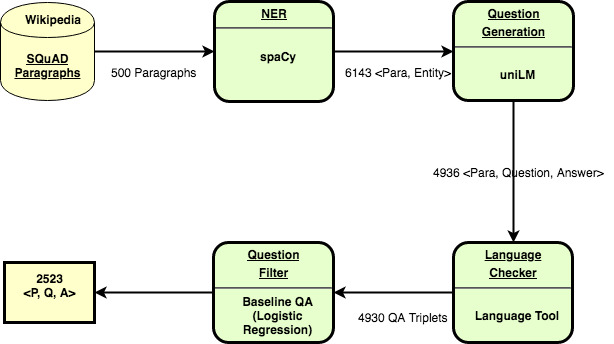
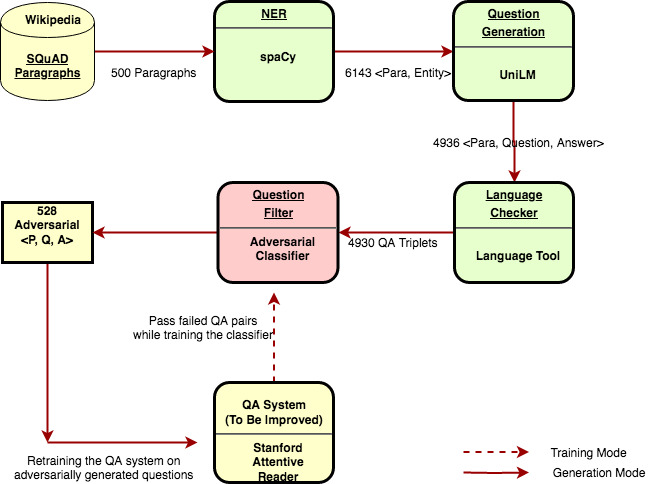
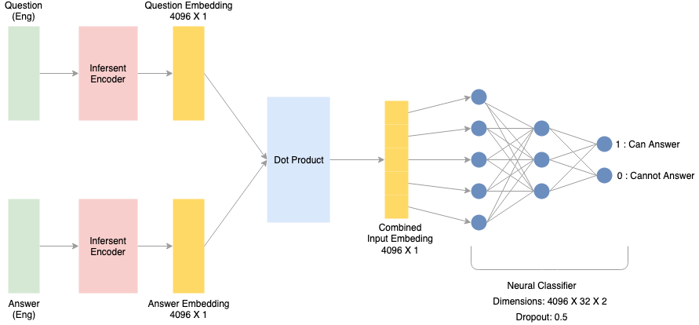

# Adversarial Question Generation
Generate questions on which a given QA system will fail.

## QA Dataset Generation Framework

Original Source Of Codebase:

1. NER - https://spacy.io/usage/linguistic-features#named-entities  
Wrote our own scripts to use it. Please see the readme in NER folder.

2. Question Generation - UniLM - https://github.com/microsoft/unilm  
Added few scripts for data formatting and running the model on CPU.
Please see the readme in QG/UniLM folder.

3. Language Checker - https://github.com/myint/language-check  
Please see the readme in language-check folder.

4. QA Baseline - https://worksheets.codalab.org/worksheets/0xd53d03a48ef64b329c16b9baf0f99b0c/  
We uploaded our augmented dataset on Codalab and ran the Logistic Regression QA baseline over it.

## Adversarial QA Dataset Generation Framework

### Adversarial Classifier

We coded the binary classifier from scratch. We used the infersent embeddings.

